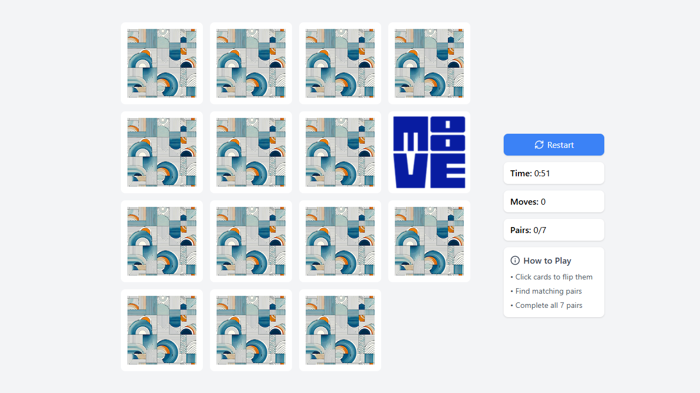

# Memory Card Game

A modern, interactive web-based memory matching game built with React, TypeScript, and Framer Motion animations.



## Features

- Interactive memory matching game with smooth 3D card flip animations
- 6 pairs of cards with modern geometric designs
- Performance tracking (moves, time elapsed, pairs matched)
- Responsive layout with game board and statistics sidebar
- Easy restart functionality
- Customizable branding and card designs

## Tech Stack

- **Frontend Framework**: React 18 with TypeScript
- **Build Tool**: Vite
- **Styling**: Tailwind CSS
- **Animations**: Framer Motion
- **Icons**: Lucide React

## Installation

### Prerequisites

- Node.js (v16 or higher)
- npm or yarn

### Setup

1. Clone the repository:
   ```bash
   git clone [repository-url]
   cd memory-card-game
   ```

2. Install dependencies:
   ```bash
   npm install
   # or
   yarn
   ```

3. Start the development server:
   ```bash
   npm run dev
   # or
   yarn dev
   ```

4. Open your browser and navigate to `http://localhost:5173`

## How to Play

1. The game consists of 12 cards (6 pairs) arranged in a 4x3 grid
2. Click on a card to flip it and reveal the image
3. Try to find matching pairs by remembering card positions
4. When you find a matching pair, the cards remain face-up
5. If the cards don't match, they flip back after a brief moment
6. The game is complete when all pairs are matched
7. Try to complete the game in the fewest moves and shortest time!

## Game Statistics

The game tracks the following statistics:
- **Moves**: The number of pairs of cards you've flipped
- **Time**: The elapsed time since the game started
- **Pairs**: The number of pairs you've matched out of the total (6)

## Project Structure

```
project/
├── public/
│   └── images/           # Card images
│       ├── card-back.png # Back of all cards
│       ├── card1.png     # Card face images
│       ├── card2.png
│       ├── card3.png
│       ├── card4.png
│       ├── card5.png
│       ├── card6.png
│       └── center.png    # Center logo (optional)
├── src/
│   ├── components/       # React components
│   │   ├── Card.tsx      # Individual card component
│   │   ├── GameBoard.tsx # Main game logic and layout
│   │   └── Timer.tsx     # Game timer component
│   ├── config/           # Configuration files
│   │   ├── branding.ts   # Branding configuration
│   │   └── types.ts      # TypeScript interfaces
│   ├── App.tsx           # Main application component
│   ├── index.css         # Global styles and Tailwind imports
│   └── main.tsx          # Application entry point
└── configuration files   # Various config files for the project
```

## Customization

The Memory Card Game is designed to be easily customizable. You can rebrand the game by:

- Replacing card images with your own designs
- Adjusting the number of card pairs
- Using SVG-based cards instead of images
- Modifying the game's appearance

For detailed instructions on how to customize the game, please refer to the [Rebranding Guide](./rebranding-guide.md).

## Development

### Available Scripts

- `npm run dev`: Start the development server
- `npm run build`: Create a production build
- `npm run preview`: Preview the production build locally
- `npm run lint`: Run ESLint to check for code issues

### Building for Production

To create a production build:

```bash
npm run build
# or
yarn build
```

The build artifacts will be stored in the `dist/` directory.